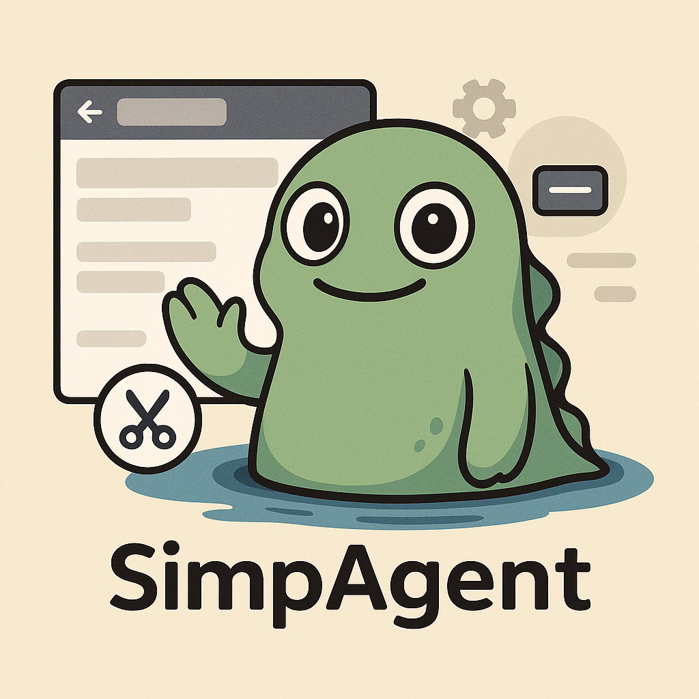
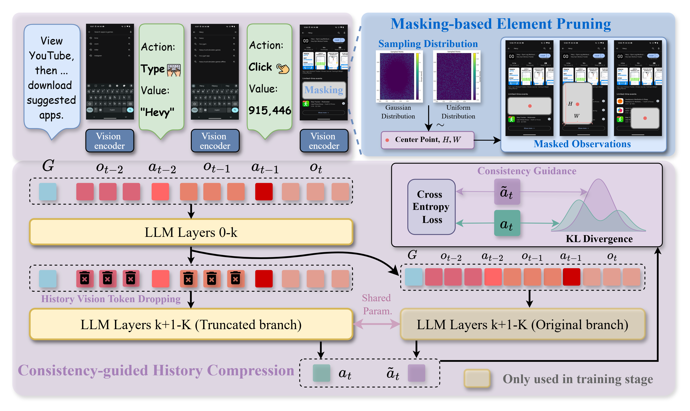
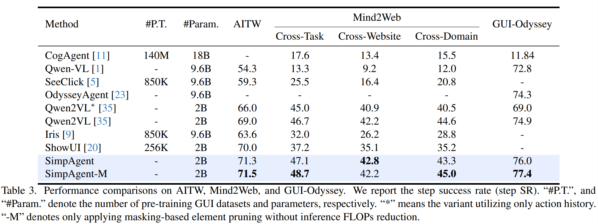

<div align="center">
<h2 align="center">
    <b>Less is More: Empowering GUI Agent with Context-Aware Simplification
   <br /> <font size=3>ICCV 2025 </font></b> 
</h2>
<div>
<a target="_blank" href="https://scholar.google.com/citations?user=Mpg0w3cAAAAJ&hl=en&oi=ao">Gongwei&#160;Chen</a><sup>1</sup>,
<a target="_blank">Xurui&#160;Zhou</a><sup>1</sup>,
<a target="_blank" href="https://scholar.google.com/citations?user=9Vc--XsAAAAJ&hl=en&oi=ao">Rui&#160;Shao</a><sup>1&#9993</sup>,
<a target="_blank">Yibo&#160;Lyu</a><sup>1</sup>,
<a target="_blank" href="https://jnhujnhu.github.io/">Kaiwen&#160;Zhou</a><sup>1</sup>,
<br>
<a target="_blank" >WenTao&#160;Li</a><sup>2</sup>,
<a target="_blank" href="https://yinchuanll.github.io/">Yinchuan&#160;Li</a><sup>2</sup>,
 <a target="_blank" href="https://zhongangqi.github.io/">Zhongang&#160;Qi</a><sup>2</sup>,
 <a target="_blank" href="https://scholar.google.com/citations?hl=en&user=yywVMhUAAAAJ">Liqiang&#160;Nie</a><sup>1&#9993</sup>
</div>
<sup>1</sup>Harbin Institute of Technology, Shenzhen&#160&#160&#160</span>
<sup>2</sup>Huawei Noah’s Ark Lab</span>
<br />
<sup>&#9993&#160;</sup>Corresponding author&#160;&#160;</span>
<br/>
<div align="center">
    <a href="https://arxiv.org/abs/2408.03615" target="_blank">
    </a>
</div>
</div>

Xurui Zhou, Rui Shao, Yibo Lyu, Kaiwen Zhou, Shuai Wang, WenTao Li, Yinchuan Li, Zhongang Qi, Liqiang Nie


## :new: Updates
- [06/2025] :fire: We release the code. Enjoy it!
- [06/2025] :fire: SimpAgent is accepted to **ICCV 2025**!


## Install Dependencies
```shell
pip install -r requirement.txt
```
Due to a bug in Transformers v4.45.2, please replace the transformers-qwen2vl model file with SimpAgent/src/model_file/modeling_qwen2vl.py to ensure the correctness of the rope_encoding implementation.

## How to run
```shell
bash scripts/finetune_lora.sh
```

## :balloon: SimpAgent Framework
Overview of our context-aware simplification framework for building SimpAgent. The main components are masking-based element pruning and consistency-guided history compression. We assist SimpAgent in mitigating interference from unrelated elements by masking certain regions based on a pre-defined distribution. During training, we maintain the consistency between two LLM branches for explicitly steering history compression. At inference, SimpAgent only uses the LLM branch with truncated tokens, reducing 27% FLOPs.

## :smile_cat: Evaluation results
Performance comparisons on AITW, Mind2Web, and GUI-Odyssey. We report the step success rate (step SR). #P.T., and #Param. denote the number of pre-training GUI datasets and parameters, respectively. * means the variant utilizing only action history. -M denotes only applying masking-based element pruning without inference FLOPs reduction.



## :balloon: Visualization of attention
Illustration of attention maps in agent models w/ and w/o consistency guidance, and their attention difference map. The **attention difference map** shows that action tokens pay more attention (highlighted positions) to historical observation tokens when they act as query tokens with consistency guidance. This attention comparison demonstrates that consistency guidance can promote the information aggregation from observations to actions and facilitate the history compression.


## Acknowledgement
- We built our code based on: [Qwen2-VL-Finetuning](https://github.com/2U1/Qwen2-VL-Finetune). Thanks 2U1!


